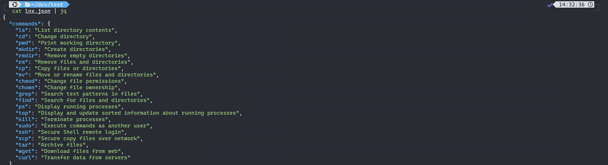

In my work life, I use a company-issued Windows 11 laptop. I genuinely enjoy working across all the major operating systems, from Linux and macOS to Windows itself—I’ve found that Windows has evolved in some really interesting ways, especially when it comes to Linux and Open Source software.

One of the very first things I do when setting up a new Windows system is make sure the [Windows Subsystem for Linux (WSL2)](https://learn.microsoft.com/en-us/windows/wsl/about) is installed and configured just the way I like it. I’ve been using WSL on a daily basis for years, and it’s become an essential part of my workflow, allowing me to run all the Linux tools I need in a familiar, integrated environment. Plus, it’s improved massively since I first tried it out on Windows 10 back in 2017.

In this post, I’ll explain why WSL matters, how Microsoft’s approach to open source has shifted, and share some of my favourite power user tips to help you get the most out of it.

---

## What is WSL and Why Should You Care?

WSL is Microsoft’s way of bringing the Linux experience to Windows—without the fuss of dual booting or running a heavyweight virtual machine. It lets you run a full Linux environment right inside your Windows setup, complete with access to all your favourite command-line tools, package managers, and even GUI apps thanks to WSLg.

For me, this means I can write and test Bash scripts, manage Linux servers, and run open source tools—all from the comfort of my Windows desktop. It’s perfect for developers, sysadmins, and anyone who wants to bridge the gap between Windows and Linux.

---

## Why is Microsoft Suddenly All In on Open Source?

If you’ve been around the tech world for a while, you’ll remember when Microsoft and open source were sworn enemies. But times have changed. Under [Satya Nadella](https://en.wikipedia.org/wiki/Satya_Nadella), Microsoft has embraced open source in a big way—contributing to the Linux kernel, open sourcing .NET, and even buying [GitHub](https://news.microsoft.com/source/2018/06/04/microsoft-to-acquire-github-for-7-5-billion/).

Microsoft’s commitment to WSL didn’t stop at just improving its features and performance—they went one step further. At the Build 2025 Conference, Microsoft announced that [WSL2 is now open source (most of)](https://www.zdnet.com/article/microsoft-finally-open-sources-most-of-windows-subsystem-for-linux/), marking a significant milestone for developers everywhere. This means anyone can download, inspect, modify, and contribute to the WSL codebase on GitHub, fostering greater transparency and community collaboration. It’s a clear signal that Microsoft is serious about supporting open source and empowering developers to shape the future of Linux on Windows

So why the shift? It’s all about staying relevant. The cloud, DevOps, and modern software development are built on open source. By supporting tools like WSL, Microsoft is making Windows more attractive to developers and IT pros who need to work in both worlds.

---

## Why Should You Use WSL?

Here are a few reasons why I appreciate WSL:

- **Access to Linux Tools:** Run your favourite cli tools and package managers right from Windows.
- **Seamless Workflows:** No more switching between operating systems or juggling VMs.
- **Cross-Platform Development:** Test your code on Linux and Windows from the same machine.
- **Lightweight and Fast:** WSL starts up quickly and uses fewer resources than a full VM.
- **Integration:** Use Linux GUI apps on your Windows desktop and access files between both systems with ease.

---

## How to Install and Enable WSL on Windows 11

Microsoft has made installing WSL incredibly straightforward. Here’s how you can do it, step by step:

1. Open Windows Terminal (Admin)

Right-click the Start button and select Terminal (Admin) or Windows Terminal (Admin). If prompted by User Account Control (UAC), click Yes to allow changes.

2. Install WSL

In the Terminal window, enter the following command:

```powershell
wsl --install
```

This command will:

- Enable the required Windows features (including WSL and the Virtual Machine Platform).
- Download and install the latest Linux kernel.
- Install Ubuntu as the default Linux distribution (unless you specify otherwise).

3. Restart Your Computer

After the installation completes, you’ll be prompted to restart your computer. This is necessary for the changes to take effect:

```powershell
Restart-Computer
```

Or simply use the Windows Start menu to restart.

4. Set Up Your Linux Distribution

After restarting, open Windows Terminal again (you don’t need admin this time).
Ubuntu (or your chosen distro) will start automatically.

You’ll be asked to create a new UNIX username and password (this is for Linux, not your Windows account).

Once set up, you can update your Linux distribution by running:

```bash
sudo apt update && sudo apt upgrade
```

This ensures you have the latest packages and security updates.

5. (Optional) Install a Different Linux Distribution

If you want to install a distro other than Ubuntu you can list the available distributions:

```powershell
wsl --list --online
```

Install your preferred distro (replace DistroName with the name from the list):

```powershell
wsl --install -d DistroName
```

For example, to install Debian:

```powershell
wsl --install -d Debian
```

6. Launch and Use WSL

You can launch your Linux distribution from the Start menu or directly from Windows Terminal. Access Linux commands and tools as you would on a native Linux system.

---

## WSL Configuration Settings

I recommend that you customise WSL to your requirements by making use of the `.wslconfig` and `wsl.conf` files. There are a wide range of configuration settings available and it is worth checking them out by visiting [Advanced settings configuration in WSL](https://learn.microsoft.com/en-us/windows/wsl/wsl-config#wslconf).

### 1. Customise `.wslconfig`

The `.wslconfig` is located at `C:\Users\<UserName>` and allows you to configure global settings across all installed distributions running on WSL.

- **Example `.wslconfig`:**

```ini
 [wsl2]
memory=4GB
processors=2
swap=4GB
localhostForwarding=true
nestedVirtualization=false
vmIdleTimeout=60
```

### 2. Customise `wsl.conf`

The `wsl.conf` is located within your Linux distro at `/etc/wsl.conf` and allows you to configure settings per-distribution for WSL.

- **Example `wsl.conf`:**

```ini
[boot]
systemd=true

[network]
generateResolvConf = true

[user]
default=<user>

[interop]
enabled = true
```

---

## Interoperability Between Windows & Linux

WSL makes it easy to mix Windows and Linux tools:

**Open Windows Explorer from WSL:**  

  ```bash
  explorer.exe .
  ```

**Run Windows apps from WSL:**  

  ```bash
  notepad.exe .bashrc
  ```

 **Access WSL files from Windows:**  
Enter `\\wsl$\` in Windows Explorer to browse your Linux files.

### Run Linux Apps on Windows

WSL allows you to run Linux GUI based apps on Windows. For example, you can run the Nautilus graphical file manager in WSL on Windows:

1. **Install Nautilus:**

```bash
sudo apt update
sudo apt install nautilus -y
```

2. **Launch Nautilus:**  

```bash
sudo nautilus
```

(Requires WSLg or an X server for GUI support.)

---

## Supercharge Your Shell

In Linux there are many shells to choose from such as bash, zsh and fish. I recommend exploring different shells and finding which works best for you. I prefer to use zsh with [ohmyzsh](https://ohmyz.sh/). If you want to follow a similar configuration, I recommend this short and easy guide to get it configured [Oh My Zsh + PowerLevel10k = 😎 terminal](https://dev.to/abdfnx/oh-my-zsh-powerlevel10k-cool-terminal-1no0).

Here is how my WSL shell currently looks:



I keep all my configuration files—such as `.zshrc`, `.tmux.conf`, and shell aliases—[under source control](https://github.com/aut0nate/dotfiles). This approach means that no matter what system I’m using—whether it’s WSL on Windows, a macOS terminal, or a Linux desktop—I can quickly sync my settings and enjoy a consistent, familiar shell environment everywhere. It’s a simple trick that saves time and ensures I feel right at home, no matter which platform I’m working on.

---

## Final Thoughts

**WSL is one of those rare tools that genuinely simplifies life for anyone who works across both Windows and Linux environments.** Whether you’re streamlining your automation workflows, developing cross-platform software, or simply curious about new technology, WSL offers a seamless bridge between the two worlds. For developers, sysadmins, and tech enthusiasts alike, adding WSL to your toolkit means greater flexibility, productivity, and the freedom to work the way you want—making it an essential addition for those who want the best of both worlds.
