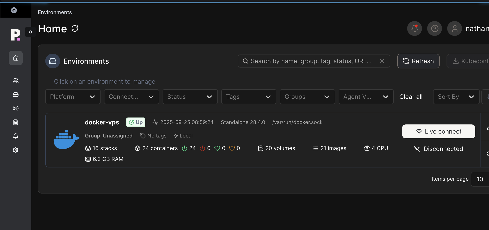

When I first started exploring the world of homelabs, I thought it had to involve racks of hardware, blinking lights, and endless tinkering. I even wrote about my early experiments [here](https://blog.autonate.dev/posts/my-homelab-journey/). At that time, I repurposed an old desktop PC and dived head-first into virtualisation with Proxmox, containers, and self-hosted services.

It was fun, but I quickly realised that what really interested me wasn’t the hardware - it was the **software and services**. I loved spinning up tools, learning how they worked, and making them accessible on my own terms. The hardware side, while interesting, left me feeling stuck in “decision paralysis”, what’s the perfect setup? What hardware should I buy next? Should I build a Kubernetes cluster? Instead of enjoying the process, I was constantly second-guessing.

So I decided to simplify my approach. I went down the **Virtual Private Server (VPS)** path, and I haven’t looked back since.

## Why a VPS?

The [homelab subreddit](https://www.reddit.com/r/homelab/) is full of impressive setups, dedicated racks, enterprise gear, and serious investment. I enjoy seeing those, but for me, a **low-cost VPS was the right middle ground**.

Here’s why:

- No worries about hardware failures or power bills.

- Easy to scale resources as needed.

- Always online and accessible, without poking holes in my home network.

- Fulfils my core goals when I started this journey of learning more about Linux and Docker

After looking around, I landed on [Contabo](https://contabo.com/en/vps/). Their VPS plans are very affordable and, so far, rock-solid in performance. I started with a fresh Ubuntu install and built my cloud lab from there.

## The Core Stack

On my VPS, the host is running a few key services that everything else builds on:

- **Docker** – Containers are the backbone of my setup. I run 20+ services in stacks, all managed via Portainer.

- **Tailscale** – Provides secure private access to services I don’t want on the public internet.

- **Cloudflare Tunnels** – Handles exposure of public services without needing to open ports or worry about DDoS protection.

This trio of **Docker**, **Tailscale**, and **Cloudflare Tunnels** is what makes the whole setup simple, secure, and scalable.

## Private Services (Tailnet Only)

Some services don’t need to be on the public internet. These run exclusively inside my Tailnet:

- **Nginx Proxy Manager** – SSL termination and reverse proxying.

- **Portainer** – GUI for managing containers and stacks.

- **Uptime Kuma** – Uptime monitoring for my services.

- **File Browser**  – Quick access to files on my VPS via a GUI.

With Tailscale, I can access these from anywhere without exposing them. No port forwarding and no firewall headaches - it just works!

## Public Services (Through Cloudflare + Nginx Proxy Manager)

For services I want to access outside my Tailnet, I combine **Nginx Proxy Manager (NPM)** with **Cloudflare Tunnels**.

NPM handles SSL termination and routes requests to the right backend containers. Cloudflare gives me a secure entry point into my VPS, without exposing my IP directly.

Some examples of my public-facing services:

- **n8n** – My automation hub.

- **Miniflux** – My RSS reader.

- **IT Tools** – A handy collection of web utilities.

I’ve also added [Authentik](https://goauthentik.io/) as my identity provider, replacing basic auth with proper single sign-on. For example, Miniflux now sits neatly behind Authentik, which feels both professional and secure.

## My Lab

Here are some screenshots which demonstrate my setup:

**Portainer**:

**Tailscale**:

**Nginx Proxy Manager**:

## Lessons Learned

Running a VPS homelab has taught me a few important lessons:

1. **Start small**. Don’t get overwhelmed with hardware or architecture decisions. Just spin up a service and learn from there.

2. **Things will break**. Sometimes you just need to step away, sleep on it, and return with fresh eyes.

3. **Homelabs are personal**. There’s no single “correct” setup. What matters is what works for you.

And while I’ve gone the VPS route, I still have my original machine humming away under my desk. These days, it runs a mix of Linux and Windows VMs, including a small domain controller tied into Azure which is mainly for work testing.

## Final Thoughts

I may revisit a full hardware-based homelab one day, but for now, my VPS with Contabo strikes the right balance. It gives me the freedom to explore, learn, and self-host without the overhead of managing hardware.

Contabo has been solid so far, and I wouldn’t hesitate to recommend them if you’re curious about trying the VPS route yourself.

The beauty of homelabs is their **flexibility**, they can be as simple or as complex as you want. Mine lives on a VPS, yours might live in a rack in your garage, and both are equally valid.

At the end of the day, it’s about learning, experimenting, and having fun with technology.
