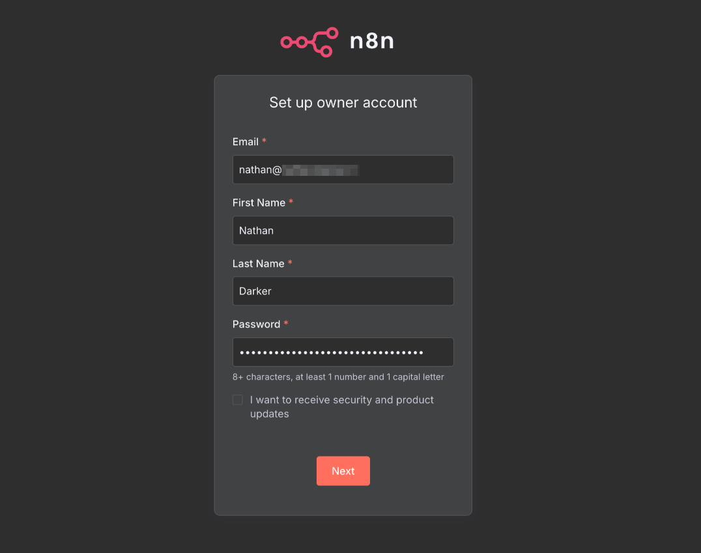
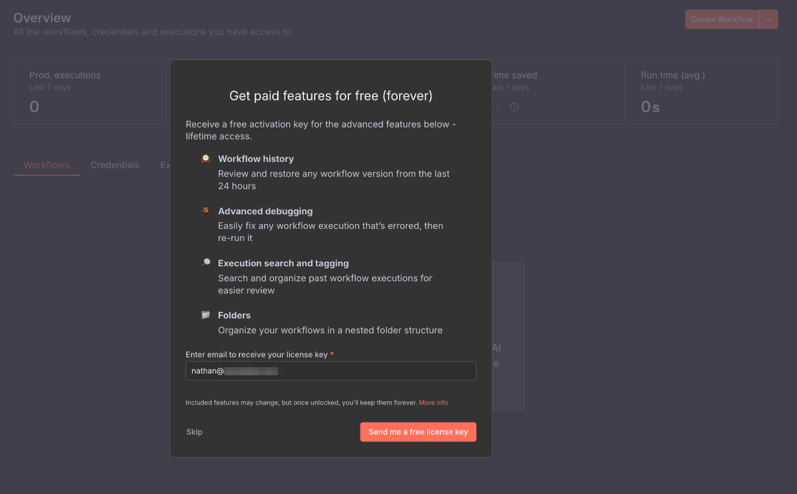
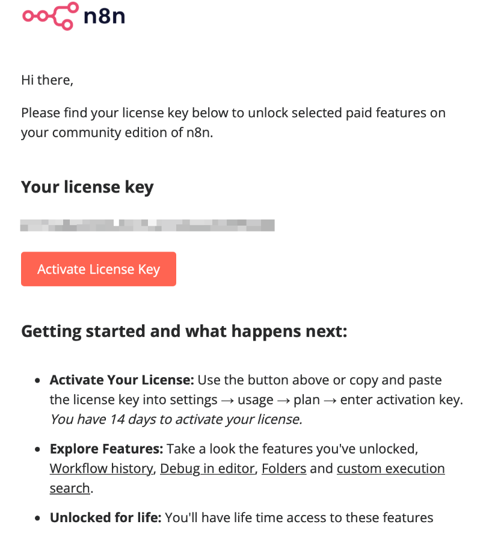

Automation has always fascinated me for its ability to simplify complex processes and free up time for creative work. That curiosity naturally led me to explore new tools and that’s how I discovered **n8n**, a workflow automation platform that has quickly become one of my favourite tools.

I kept seeing videos and articles about n8n pop up and it was one of those tools that never quite left my “must-try” list. As someone who’s passionate about automation, I was curious to see what made it stand out. Once I started digging deeper, I quickly realised how powerful and flexible it was.

## What is n8n?

[n8n](https://n8n.io/) (short for *“nodemation”* and pronounced *n-eight-n*) is a **workflow automation platform** that lets you connect apps, services, and APIs without writing complex code. Think of it as a self-hosted alternative to Zapier or Make but with far greater flexibility and control.

It uses **nodes** to represent actions or data transformations, and you can chain these nodes together in **workflows** to automate almost anything - from sending emails and integrating APIs to building AI-powered data agents.

Best of all, you can **self-host n8n**, giving you full control over your data and privacy, something that really resonated with me.

## Setting It Up in My Homelab

Before diving in, there are a few prerequisites: a running Docker environment (or Portainer if you prefer a GUI), a domain managed through a provider like Cloudflare, and some basic knowledge of reverse proxying with tools such Nginx Proxy Manager. Once those are set up, the rest is easy.

With plenty of spare resources in my homelab, running n8n on my VPS was an obvious choice. I deployed it via Portainer and tweaked the stack configuration to suit my setup.

Here is my docker-compose.yaml file:

```yaml
services:
  n8n:
    image: docker.n8n.io/n8nio/n8n:latest
    container_name: n8n
    expose:
      - "5678"
    restart: unless-stopped
    user: "1000:1000"
    environment:
      # General settings
      - TZ=Europe/London
      - N8N_HOST=${SUBDOMAIN}.${DOMAIN_NAME}        # e.g., n8n.example.com
      - N8N_PORT=5678
      - N8N_PROTOCOL=https
      - NODE_ENV=production
      - WEBHOOK_URL=https://${SUBDOMAIN}.${DOMAIN_NAME}/
      - N8N_RUNNERS_ENABLED=true
      - N8N_ENFORCE_SETTINGS_FILE_PERMISSIONS=true

      # Database
      - DB_TYPE=postgresdb
      - DB_POSTGRESDB_HOST=n8n-db
      - DB_POSTGRESDB_PORT=5432
      - DB_POSTGRESDB_USER=${N8N_DB_USER}
      - DB_POSTGRESDB_PASSWORD=${N8N_DB_PASSWORD}
      - DB_POSTGRESDB_DATABASE=${N8N_DB_NAME}

      # Security / Privacy
      - N8N_BLOCK_ENV_ACCESS_IN_NODE=false
      - N8N_DIAGNOSTICS_ENABLED=false
      - N8N_VERSION_NOTIFICATIONS_ENABLED=false
      - N8N_TRUSTED_PROXIES=${N8N_TRUSTED_PROXIES}

    volumes:
      - n8n_data:/home/node/.n8n
      - ./local-files:/files
    networks:
      - edge-net
      - n8n-backend
    depends_on:
      n8n-db:
        condition: service_healthy
    security_opt:
      - no-new-privileges:true
    read_only: true
    tmpfs:
      - /tmp
      - /home/node/.cache:uid=1000,gid=1000,mode=770
    logging:
      options:
        max-size: "10m"
        max-file: "3"

  n8n-db:
    image: postgres:15-alpine
    container_name: n8n-db
    restart: unless-stopped
    environment:
      - TZ=Europe/London
      - POSTGRES_USER=${N8N_DB_USER}
      - POSTGRES_PASSWORD=${N8N_DB_PASSWORD}
      - POSTGRES_DB=${N8N_DB_NAME}
    volumes:
      - n8n-db:/var/lib/postgresql/data
    networks:
      - n8n-backend
    healthcheck:
      test: ["CMD-SHELL", "pg_isready -U ${N8N_DB_USER} -h localhost"]
      interval: 10s
      timeout: 5s
      retries: 5
      start_period: 30s
    security_opt:
      - no-new-privileges:true
    logging:
      options:
        max-size: "10m"
        max-file: "3"

volumes:
  n8n_data:
  n8n-db:

networks:
  edge-net:
    external: true
  n8n-backend:
    driver: bridge
```

Here is my .env file:

```bash
DOMAIN_NAME=example.com
SUBDOMAIN=n8n
N8N_DB_USER=myuser
N8N_DB_PASSWORD=supersecretpassword
N8N_DB_NAME=n8n
N8N_TRUSTED_PROXIES=127.0.0.1
```


After confirming the stack was running, I configured my Cloudflare Tunnel and linked my subdomain through Nginx Proxy Manager for external access. Then I created the owner account, registered for the free license key, and activated my instance - simple and seamless.







**Note:** If you want to self-host n8n, check out the official [installation guide](https://docs.n8n.io/hosting/installation).

## Learning by Doing

n8n acts as a bridge between systems that were never designed to talk to each other, a simple yet powerful way to connect APIs, webhooks, and apps into one cohesive ecosystem.

I learn best by doing, so I watched a few YouTube tutorials to understand the basics: **workflows**, **nodes**, and **credentials**. The official n8n Tutorials playlist is a great place to start: [YouTube](https://www.youtube.com/watch?v=4cQWJViybAQ&list=PLlET0GsrLUL5HKJk1rb7t32sAs_iAlpZe).

It only took a few days to feel comfortable, and once I understood the fundamentals, everything clicked. The visual interface makes experimentation easy, while the modular design means you can start small and gradually build more complex automations at your own pace.

## From Linear Workflows to AI-Powered Agents

The feature that really caught my attention was **AI Agents**. This isn’t your standard “if-this-then-that” automation - AI Agents bring **context and memory** into workflows. Instead of following a rigid sequence of actions, they can make decisions based on previous interactions.

As someone deeply invested in AI, this immediately stood out. You can connect to major LLM providers such as **OpenAI**, **Google**, or my personal favourite, **OpenRouter**, for its wide range of models and flexibility. Setting it up is as easy as adding your OpenRouter API key in the credentials section.

## Final Thoughts

Exploring n8n has been very rewarding and it reminded me how powerful automation tools can be when paired with curiosity and experimentation. If you’re considering trying it, start small,  connect two tools you already use and see what happens. You’ll be amazed at how quickly ideas evolve once you see what’s possible.

After just a few weeks, n8n has become a cornerstone of my automation workflow stack. It’s flexible, powerful, and endlessly extendable and best of all, it’s free and self-hostable.

If you’re passionate about automation, have a homelab, or simply want to connect your favourite tools in smarter ways, [n8n](https://n8n.io/) is absolutely worth your time. I’ll be sharing more about the workflows I’m building soon, including how I’m using AI Agents to create dynamic, context-aware automations.
