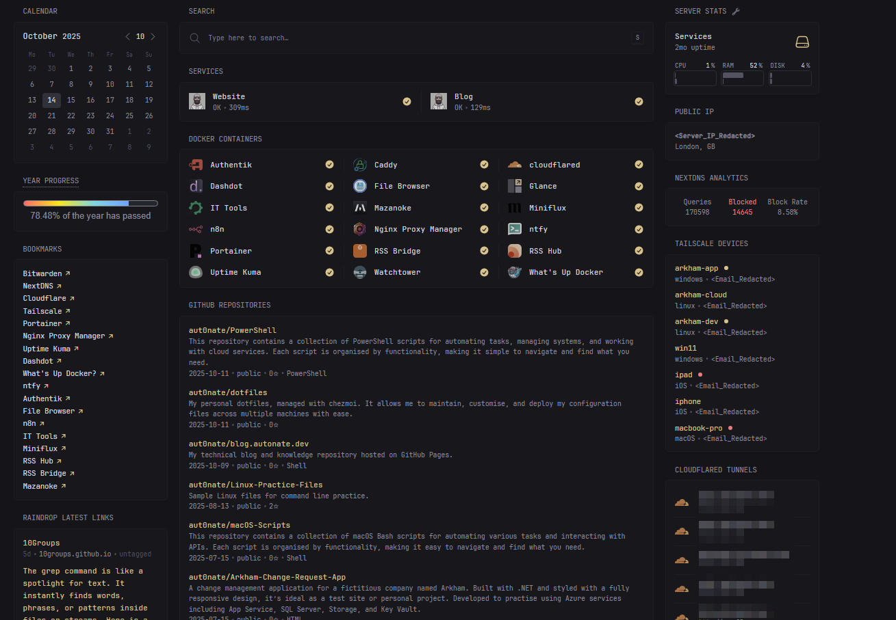

I recently started using **[Glance](https://github.com/glanceapp/glance)** as the primary dashboard for my homelab, and it has quickly become one of my most-used tools. Glance allows me to monitor all my Docker containers, network devices, and services at a glance (pun intended), all within a clean, minimalist interface. It’s lightweight, fast, and extremely customisable, giving me real-time visibility into my entire environment.

## What Is Glance?

Glance is a self-hosted dashboard that you can configure entirely through a simple YAML file. It’s designed for speed, clarity, and ease of maintenance while giving you total control over layout and content. You can display container statuses, system metrics, bookmarks, RSS feeds, or even pull live data from APIs. It offers a clean, centralised view. of the information that matters most, keeping everything organised and accessible.

The built-in widgets are well-designed and easy to set up, requiring only a few lines of YAML to get started. You can find a full list of widgets and configuration options here: **[Glance Widget Configuration Guide](https://github.com/glanceapp/glance/blob/main/docs/configuration.md#configuring-glance)**

For those who want to go beyond the defaults, the Glance community offers a fantastic library of custom widgets that expand its functionality even further. From monitoring external APIs to visualising network data, these widgets allow for deep personalisation: **[Community Widgets](https://github.com/glanceapp/community-widgets?tab=readme-ov-file)**

Glance’s YAML-driven design makes it extremely portable. You can easily back up, share, or version-control your entire configuration with ease.

## My Setup

In my homelab, I use Glance as both a monitoring dashboard and a quick-access portal to essential services. The combination of built-in and community widgets gives me a tailored experience that suits my daily workflow. Here are some of the custom widgets I’m currently using:

* **[Tailscale Devices](https://github.com/glanceapp/community-widgets/blob/main/widgets/tailscale-devices/README.md)** – Displays all devices connected to my Tailscale network.
* **[Cloudflare Tunnels](https://github.com/glanceapp/community-widgets/blob/main/widgets/cloudflared-tunnels/README.md)** – Shows the status of my active Cloudflare tunnels.
* **[NextDNS Stats](https://github.com/glanceapp/community-widgets/blob/main/widgets/nextdns-stats/README.md)** – Provides DNS-level analytics and insights from NextDNS.
* **[GitHub Personal Repos](https://github.com/glanceapp/community-widgets/blob/main/widgets/github-personal-repos/README.md)** – Displays my GitHub repositories and their most recent updates.
* **[Raindrop Latest Links](https://github.com/glanceapp/community-widgets/blob/main/widgets/raindrop-latest-links/README.md)** – Shows the latest bookmarks I’ve added in Raindrop.io.
* **[Time Bar](https://github.com/glanceapp/community-widgets/blob/main/widgets/time-bar/README.md)** – Adds a clean, visual representation of the day’s progress across the top of my dashboard.

Configuration is simple; you define each widget in your `glance.yml` file, specify its type and parameters, and organise it into columns and pages. Before diving in, I highly recommend reading up on how Glance structures layouts using **pages** and **columns**, as this directly affects how your widgets are displayed: **[Pages & Columns Explained](https://github.com/glanceapp/glance/blob/main/docs/configuration.md#pages--columns)**

Some widgets require API keys, tokens, or service endpoints. These can be obtained from the respective services, but remember to keep your credentials safe and avoid sharing them publicly. If your configuration includes sensitive information such as API keys or tokens, you should redact this before sharing.

## My Dashboard Layout

It took me a couple of days to refine my layout, balancing functionality with aesthetics. My top section is dedicated to live monitoring, things like websites and container statuses, network devices, and DNS analytics. Below that, I keep convenience widgets such as bookmarks and GitHub repos. The result is a clean, structured dashboard that provides instant visibility into my services without unnecessary clutter.

Here’s a look at my current setup:

One of Glance’s standout features is that it’s **mobile-friendly**. Whether I’m at home or on the move, I can quickly pull up my dashboard on my phone to check that all services are running smoothly. It’s fully responsive, so nothing feels cramped or broken on smaller screens.

I also appreciate just how lightweight Glance is. It consumes minimal resources, so it runs quietly in the background without slowing down the server.

## Why Glance Works So Well

Glance fits seamlessly into my broader homelab ecosystem and serves as the entry point into my services. Although my Glance instance is technically public-facing, it’s protected behind **Authentik**, ensuring secure authentication and controlled access. This setup allows me to enjoy the convenience of remote visibility while maintaining strong security boundaries.

Another major advantage of Glance is how quickly you can make adjustments. Adding, removing, or reorganising widgets takes just a few minutes, making it easy to experiment with new layouts or test different configurations. The YAML format keeps everything readable and version-controlled, allowing for safe rollbacks and iterative improvements. Whether I’m testing a new widget from the community or reorganising columns to improve readability, the process is smooth and predictable.

## Final Thoughts

After experimenting with a range of dashboards, **Glance** is the one I’ve settled on. It’s light, fast, and flexible, offering just the right amount of customisation without complexity. It integrates seamlessly with my existing services, stays secure behind Authentik, and provides a central view of my services.

As I continue refining my homelab, I plan to explore more of what Glance can do, especially as new widgets and integrations become available. There are a few on my radar already, and I’m interested in experimenting with community-created options that connect to my other tools. The ability to adapt and expand my dashboard over time makes Glance an evolving part of my workflow.

If you run a homelab or manage multiple self-hosted services, I highly recommend giving Glance a try. Whether you want a minimalist overview or a detailed control centre, it’s an elegant, efficient solution that’s easy to maintain and a pleasure to use.
